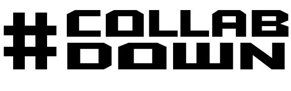

# Welcome to CollabDown!
CollabDown is a web application for collaborative document creation using MarkDown. A user can create a document, split it into sections and assign each section to a other users. The user who controls the document is the document admin. Document admins have to power approve sections, flag sections and change section details. Once a team member user is assigned a document section, they are the only user allowed to access and contribute content to that section. the admin can then approve or flag the section for further improvement.

## MarkDown
MarkDown was chosen for user text content contributions, to allow users to easily create cohesive documents together quickly with a degree of freedom and flexibility. Included in the application is access to a MarkDown 'cheat-sheet'; informing users on how to use MarkDown to improve their documents.

## Sections
By splitting the document into sections, it enables users to contribute equal amounts of effort to each collaborative document with full and open accountability. This was designed in order to allow each user to feel that their contributions would be recognised individually, whilst simultaenously preserving the collaborative team-effort of the entire document.